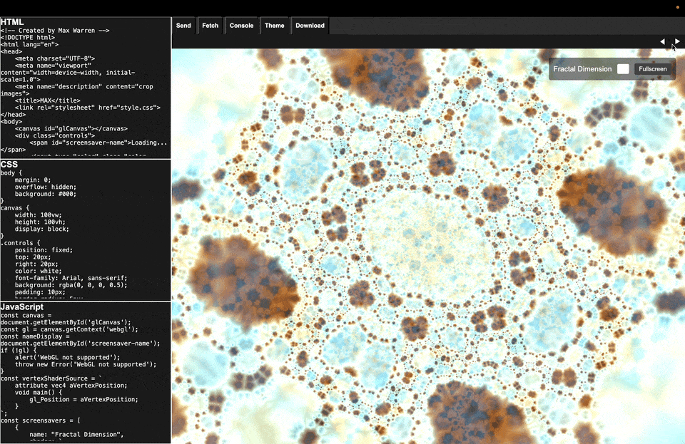

```
  ____  ___  ____  ___  _   _  ____
 / ___|/ _ \|  _ \|_ _|| \ | |/ ___|
| |___ || ||| | || | | |  \| |||  __
 \____|\___/|____/|___||_| \_|\____|
 ____    _    _   _  ____  ____  ___ __  __
/ ___|  /_\  | \ | ||  _ \| __ )/ _ \\ \/ /
\___ \ / _ \ |  \| || | |||  _ \|| || \  / 
|____//_/ \_\|_| \_||____/|____/\___/ /\/\  
for HTML-JS-CSS

Created by Max Warren
```

Join a room and edit code with others in real-time

1. Create/Join room
2. Start coding
3. Press save to push to master
4. Press fetch to bring your room up-to-date from master

# Limitations

1. Saving Overwrites all changes with no version history (external communication needed for collaboration)
2. Fetching Changes is manual


# Improvements

1. UI
2. AJAX post requests to fetch changes / store in a pre-appending state
3. Version history
4. Room Security (Join/Create)

___
